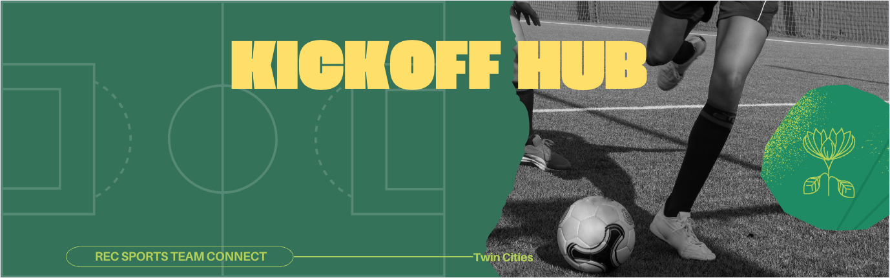


# KickOff Hub

## Inspiration for App
I play in an adult rec soccer league where players sign up individually, rate their own skill level, and teams are randomized and balanced so you play with new people every season. The league is self-managed, so the administrators are usually participating in the league as well.

I developed a starter app to be a logistical resource for the players, giving them quick info for their next games, directions, announcements, and (when they have more time) to look at previous game scores and league standings.  It also serves as an easy way for the admin (who is usually a player too) to handle scheduling, add announcements, update scores, and use all the same features as the other players.

## Color Reference

| Color             | Hex                                                                |
| ----------------- | ------------------------------------------------------------------ |
| Background |  #3a7259 |
| Accent |  #fadf5e |
| Card Background / Text |  #f7f7f7 |
| Text (Secondary) |  #383838 |


## Tech Stack

**Client:** React.js, Redux/Sagas, JavaScript, HTML, CSS, Chakra UI, FontAwesome Icons

**Server:** Node.js, Express.js

**Database:** PostgreSQL, Postico

## Features

#### Player side
- Gives player quick info on next game details, including date, time, field, jersey to wear, record opponent, link for navigating to game
- Calendar to show scheduled games, past games and their scores, canceled games status
- League standings that update in real-time as admin updates scores
- Announcements and FAQs available to see for players

#### Admin side
- Admin usually plays in the league so they have access to all the features that the player has
- Admin can switch between Player view and Admin view of the app
- Admin can see how many games need scores from past games
- Admin can update scores (or edit errors on past games that have already been updated), add/delete games in the schedule, cancel games.
- Ability to assign or reassign players to different teams
- Add announcements for players to see.

### Prerequisites

- Install Node JS on computer
```bash
  npm install
```
- add database called "kickoff_hub" (or rename DB in pool.js) 
- database.sql has tables and starting data for use of app.  Game dates can be updated to be more relevant and to show all app features, I usually choose half in the past, half in the future.  Alternatively (as you will see below), games can be added by an administrator.

## Screenshots

#### Player Home Page (home button on nav bar)
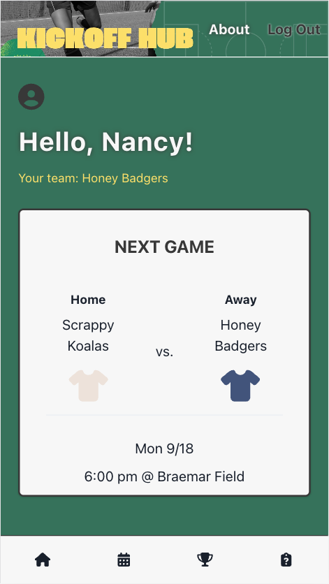

#### Game Details Page (clicking on Next Game on home page)
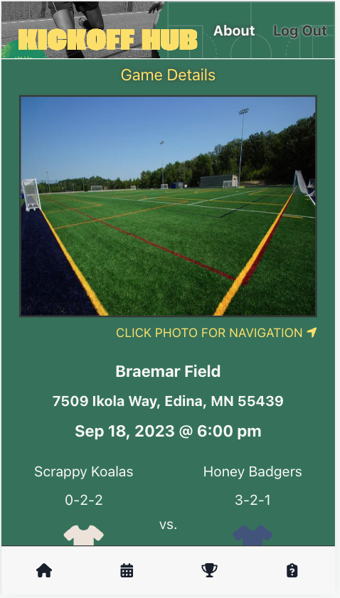

#### Upcoming Games / Past Games (calendar on nav bar)
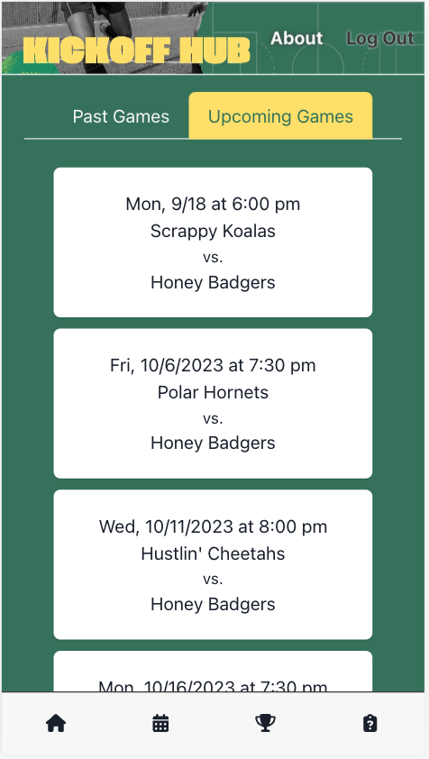
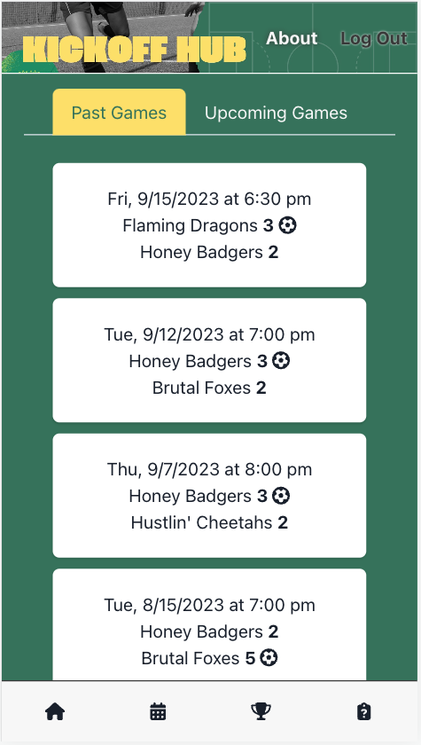

#### League Standings (trophy on nav bar)
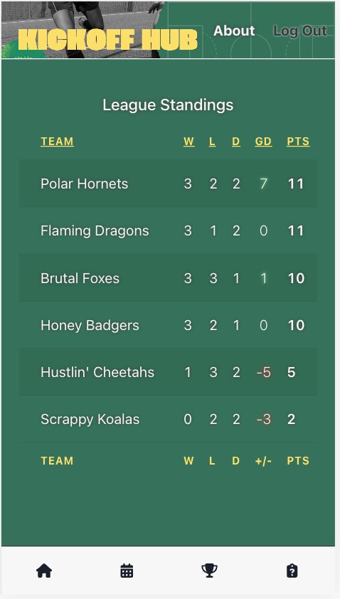

#### Announcements / FAQ (clipboard on nav bar)
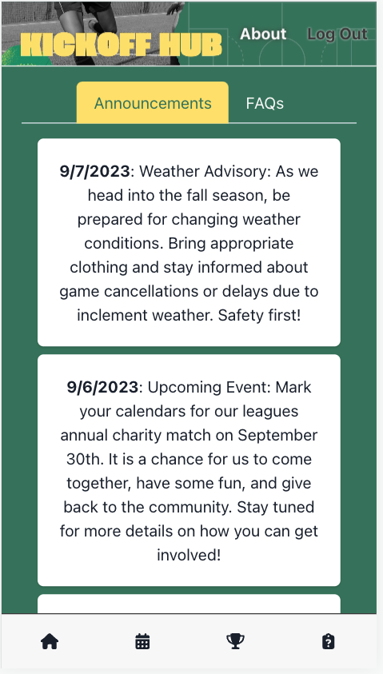

#### Admin Player-Side Home
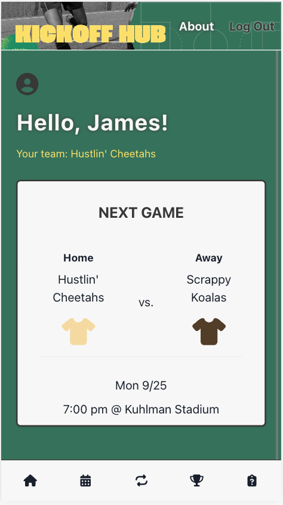

#### Admin Home (switch button in middle of nav bar for admin users only)
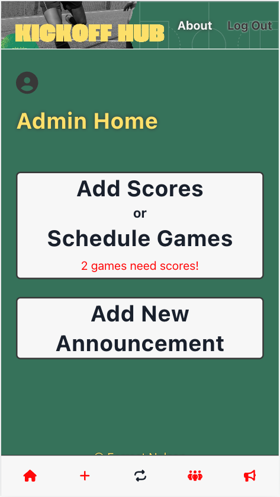

#### Admin Past Games, Scheduling Games, Upcoming Games (+ on nav bar or clicking Add Scores or Schedule Games on home page)
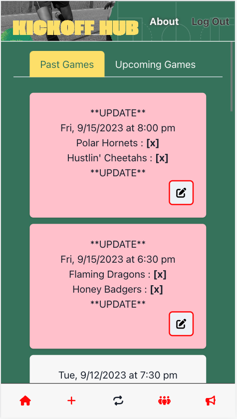
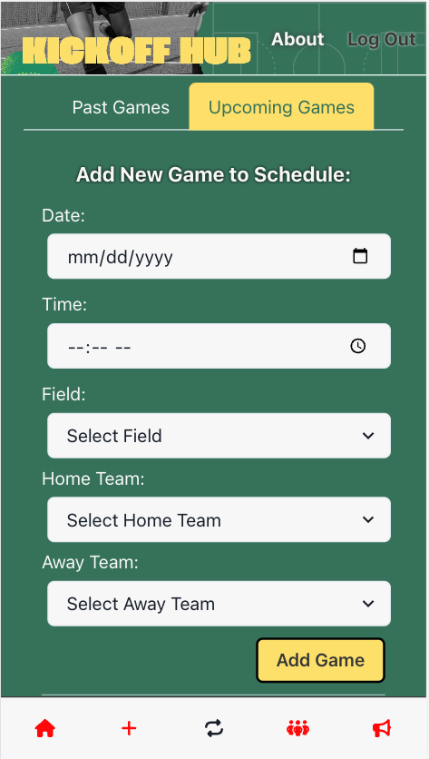
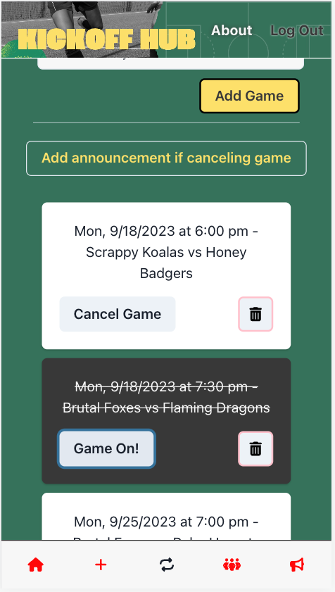

#### Admin Team Management Summary / Player Matching (team on nav bar)
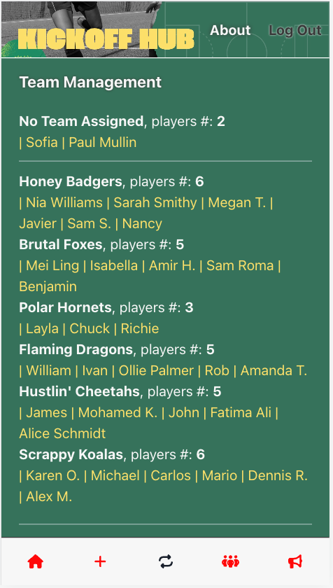
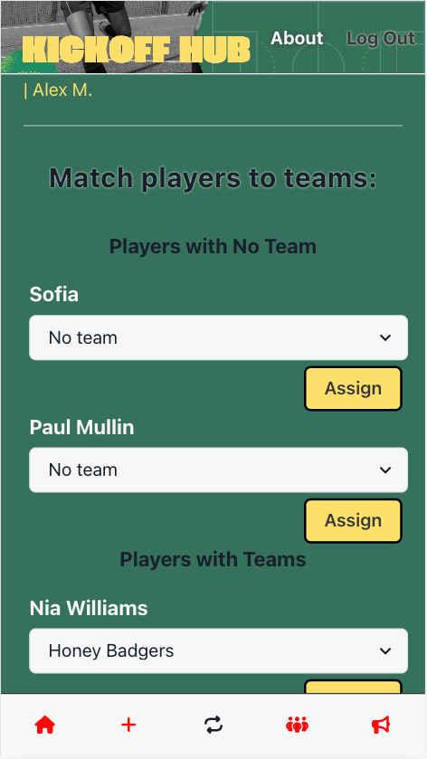

#### Admin Announcements (bullhorn on nav bar)
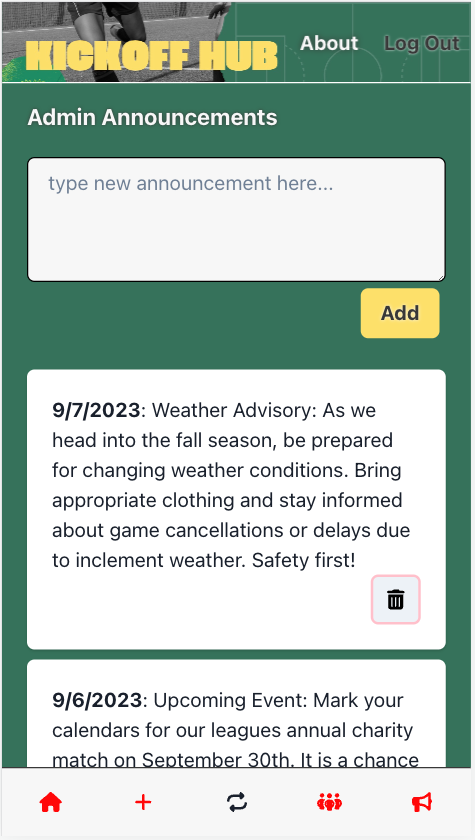

#### About Page / Special Thanks
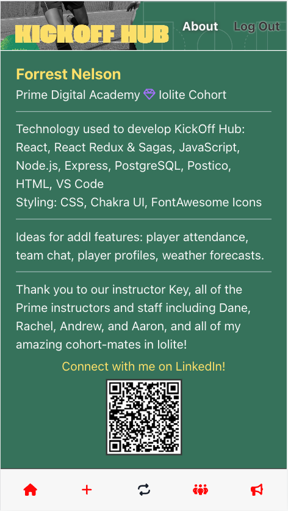

## 🔗 Links
[](https://github.com/fnnelson)
[](https://www.linkedin.com/in/forrest-nelson/)
## 🚀 About Me
My name is Forrest and I am a college graduate with a Mathematics degree and 12 years of expertise in Mortgage Underwriting. Currently, I'm expanding my skill set in full-stack software engineering. My strengths are in analytical problem-solving and enjoying collaboration with colleagues and clientele, making me a valuable asset in the tech industry. Outside of work, I'm an avid traveler, concert enthusiast, and passionate soccer player and fan.

## Acknowledgements

Thanks to my instructor Key, all of the instructors and staff in Prime Digital Academy including Dane, Rachel, Andrew, Matt, and Aaron, as well as all of my amazing cohort-mates in the Iolite cohort.